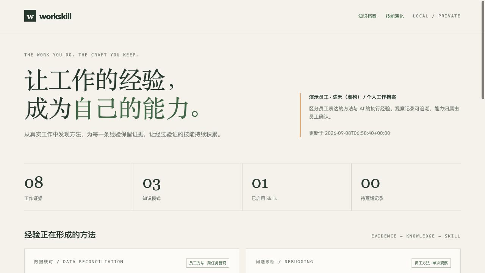
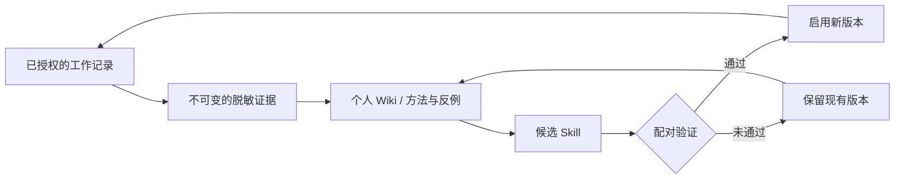

# WorkSkill

**把 Codex 工作记录里的做事方法，变成有据可查的个人 Wiki 和可复用的 Skill。**

适合经常用 Codex 开发、排查问题或处理数据，希望把有效方法留给下次使用的人。WorkSkill 从你授权的工作记录中提炼方法，保留原始证据和适用边界，再提出需要验证的 Skill 候选。

**[先跑合成数据演示](#demo)** · [安装到 Codex](#install) · [English](README.en.md) · [使用与数据格式](skills/distill-work/references/records.md)

Python **3.10+** · 运行时零第三方依赖 · [MIT](LICENSE) · 当前版本 **0.1.0**

你会得到：

- **带证据的个人 Wiki**：每条方法可以回到具体记录，查看适用条件与反例。
- **可审查的 Skill 候选**：保留版本和失败尝试；通过配对验证后才启用。
- **本地 HTML 报告**：在一个页面中查看方法、证据和版本历史。



<a id="demo"></a>
## 先用合成数据看结果

只需要 Python 和 Git；演示不读取你的真实工作记录，也不需要安装 Skill 或调用模型。

```bash
git clone https://github.com/rzr002/workskill.git
cd workskill
python3 scripts/demo.py --output /tmp/workskill-demo
```

用浏览器打开命令输出的 `report` 路径。你会看到四段虚构工作记录、三个方法模式，以及一次接受和一次拒绝的 Skill 提议。再次运行请换一个新目录。

**演示的员工、任务和评估分数均为虚构。** 它展示数据流与验证门槛，不代表实际模型性能提升。准备处理自己的记录时，继续[安装到 Codex](#install)。

## 看它如何工作



员工说“合并前检查主键唯一性，合并后核对金额总计”，可以作为其数据核对方法的证据。AI 自己说“我修好了编码问题”，只会记为 AI 执行经验。跨任务出现不同的人类方法陈述时，证据频次才会从单次观察升级为跨任务复现；这不是员工熟练度或绩效评分。

<a id="install"></a>
## 安装与第一次使用

在已克隆的 `workskill` 目录中运行：

```bash
python3 scripts/install_skill.py
```

安装器把自包含的 `skills/distill-work` 复制到 `~/.codex/skills/distill-work`。如有同名 Skill 会停止，不覆盖本地修改。`--dest` 可指定其他 Skills 父目录；`--dry-run` 只预览路径。打开一个新的 Codex 任务，输入：

> 使用 $distill-work，从我授权的项目 /绝对路径/项目 的 Codex 工作记录中蒸馏个人工作方法。记录来源为 /绝对路径/会话导出目录，个人代号为 demo-user。先更新 Wiki 和能力报告，为可复用的方法提出候选 Skill。

选择已授权的会话导出目录；标准本地 Codex 会话通常位于 `~/.codex/sessions`。导入器还会按会话及每轮工作目录过滤项目，目录前缀相似但不在项目内的会话不会纳入。不要用共享账号的混合会话推断某一个员工的能力。

仓库同时提供 `.codex-plugin/plugin.json`，可供已有 Codex 插件分发系统打包。当前开箱即用的安装入口是上面的独立 Skill 安装器；仓库未配置插件 marketplace。

## 持续更新

安装后可以对 Codex 说：

> 每天晚上 8 点使用 $distill-work 更新现有个人 Wiki。只处理已有授权范围内的新记录，有新的方法或验证结果时再通知我。

Skill 会使用宿主提供的自动化能力配置周期任务。每次增量导入、合并模式、查看失败历史，并提出新候选；缺少真实验证时保留待验证状态。**只有宿主确认创建自动化后，持续语义蒸馏才开始运行。** 安装本身不会启动后台任务。

也可仅启动本地采集：

```bash
python3 skills/distill-work/scripts/workskill.py --vault /绝对路径/私有目录 watch --interval 60
```

`watch` 只采集记录，不调用模型。完整的持续蒸馏由定时调用 Skill 的 Codex 任务完成。详见 [continuous.md](skills/distill-work/references/continuous.md)。

## 能力与边界

| 已实现 | 行为 |
| --- | --- |
| 增量导入 | Codex JSONL 可见用户/助手消息；白名单、去重、部分行恢复、常见密钥与邮箱脱敏 |
| 个人方法归属 | 员工方法 / AI 经验 / 反例分开保存；精确引用核对 |
| 持久 Wiki | 合并证据、版本记录、确认、停用；被拒绝的尝试保留 |
| Skill 编译 | 由模式生成标准 SKILL.md 和私有 PURPOSE.md，保存差异及内容哈希 |
| 验证门槛 | 配对案例、无训练会话重叠、均值提升且单案例不退化、过期候选拦截 |
| 版本管理 | 验证后启用、恢复已启用旧版本、单独导出 Skill |
| 本地报告 | 无网络资源的 HTML，支持证据展开与 Wiki/版本跳转 |

评估由调用方实际运行并提供结果；CLI 验证结果格式、证据文件和版本关联，不独立证明评分真实性。最少两个案例只是运行门槛，不构成统计意义的能力提升证据。这里没有复现 WikiSkill 的论文性能数字。

数据引擎不联网，但由 Codex 阅读的工作内容会进入你配置的模型服务。脱敏是启发式的，无法识别全部商业秘密。当前没有企业 SSO、跨租户权限、员工排名或全自动模型评估服务。

## 本地存储

默认私有目录为 `~/.local/share/workskill`，或通过 `--vault` 指定。每个人使用独立目录。

```text
private-vault/
├── config.json             # 员工代号、来源与项目白名单
├── workskill.sqlite3       # 权威记录、版本和事件日志
├── raw/                    # 不可变的脱敏可见消息快照
├── wiki/
│   ├── patterns/           # 方法、证据与适用边界
│   ├── index.md
│   ├── logs.md
│   └── skill-impact.md     # 所有提议及接受/拒绝历史
├── candidates/             # 带内容哈希的候选版本
├── evaluations/            # 评估报告与脱敏轨迹
├── skills/                 # 已启用版本
└── report.html             # 私有能力报告
```

SQLite 是权威数据；Markdown 和已启用 Skill 是可重建视图。直接编辑视图会在 `render` 时被覆盖。导出只复制已启用的 `SKILL.md`，不包含原始引用或员工来源信息；其中的业务方法文字仍需在分享前审阅。公开发布这个产品不等于发布个人 Wiki。

## 开发与验证

```bash
python3 -m unittest discover -s tests -v
python3 scripts/check_package.py
```

GitHub Actions 在 Linux、macOS、Windows 上运行测试。测试全部使用临时目录和虚构记录，不读取开发者真实工作记录。更多设计说明见 [architecture.md](docs/architecture.md)。

可选安装 CLI：`python3 -m pip install .`，之后运行 `workskill --help`。独立 Skill 安装不需要 pip。

## 来源与许可

借鉴 Tang 等人的 [WikiSkill: Compiling Agent Experience into Persistent Knowledge for Skill Evolution](https://arxiv.org/abs/2608.27454)（2026）：分离原始证据、持续知识和可执行技能，并保留失败提议的学习价值。WorkSkill 面向个人工作方法做了独立实现与产品适配，与 Google 无隶属关系。代码采用 [MIT License](LICENSE)。

## 相关项目与反馈

- 想先回顾一天或一周做过什么：[Reflect Workday](https://github.com/rzr002/reflect-workday)。
- 想组织和调用已有的个人、团队 Skills：[Personal Workbench](https://github.com/rzr002/personal-workbench)。

这些项目可以独立使用，没有自动同步个人数据的集成。试用后欢迎[提交问题或建议](https://github.com/rzr002/workskill/issues)：说明使用场景、预期结果和实际结果，并使用合成记录复现。
